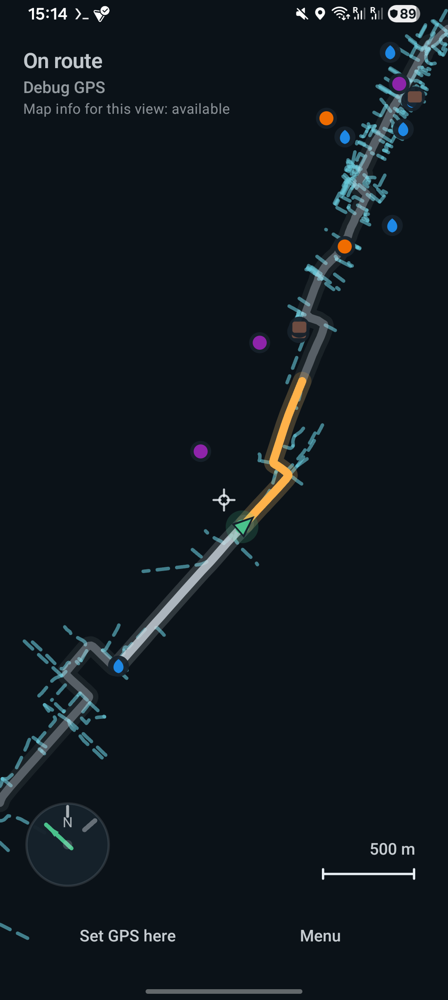

# GeePee

GeePee is a narrow Android app for following a preloaded GPX route and noticing when you drift off it.

The core screen shows the local route slice, your position relative to it, distance back to the line, route-adjacent context, and movement status.



## Workflow

1. Open a GPX file.
2. Tap route-preview tiles to download route-context data.
3. Zoom in and retry smaller tiles when Overpass rejects a large response.
4. Start monitoring and follow the route in the live view.

Tile management:

- long-press a downloaded tile to enter tile-selection mode
- tap other downloaded tiles to add/remove them
- delete selected tiles from the menu
- use `Delete unused tiles` to prune idle cached tiles

## Installation

Download the latest `geepee-vX.Y.Z-debug.apk` from the GitHub Releases page and install it on an Android phone.

With `adb`:

```bash
adb install -r geepee-vX.Y.Z-debug.apk
adb shell am start -n dev.ra.geepee/.MainActivity
```

On the phone:

- allow installation from the app that opens the APK
- grant location permission when starting monitoring
- enable GPS or network location

## Development

- JDK 21
- Android SDK platform/build tools 36
- Android platform-tools
- Android phone with `adb` debugging

Build and install:

```bash
./gradlew assembleDebug
./gradlew installDebug
adb shell am start -n dev.ra.geepee/.MainActivity
```

Test:

```bash
./gradlew testDebugUnitTest
```

Replay a checked-in GPX route to a phone:

```bash
./scripts/replay_gpx_mock.py ./routes/unneplos-tisza-ride.gpx --points 35 --period-s 1.0 --speed-mps 2.2 --noise-m 2.0 --accuracy-m 4.0
```

More replay examples are in [scripts/REPLAY.md](scripts/REPLAY.md).

Use a full JDK with `javac`:

```bash
export JAVA_HOME=/usr/lib/jvm/java-21-openjdk-amd64
export PATH="$JAVA_HOME/bin:$PATH"
```

## Route Context Data

GeePee downloads route-context tiles from Overpass and stores derived map-info data locally. The helper scripts can build the same kind of context data offline.

Context data includes:

- route-adjacent `highway=*` ways
- derived junctions
- selected bike-useful POIs like drinking water, picnic sites, shelters, toilets, and bike services

Tile concepts:

- display tiles: the outlines shown in the route preview
- data tiles: the smaller OSM context tiles that are actually downloaded
- live map-info coverage: the cached data available for the current view

Zoom level controls both display resolution and data-tile resolution. Farther out, one display tile can represent several smaller data tiles. Farther in, GeePee requests smaller data tiles.

Live map-info status is coverage-based. `Map info for this view: partly available` means cached data covers part of the current focus. Cached tiles include a halo, so side-ways and POIs can appear just beyond a downloaded tile edge.

Example:

```bash
./scripts/fetch_osm_route_context.py \
  ./routes/unneplos-tisza-ride.gpx \
  --out /tmp/unneplos-tisza-ride.osm-context.json
```

See [scripts/OSM_CONTEXT.md](scripts/OSM_CONTEXT.md).

## Release APK

Push a tag or run the `Release APK` workflow:

```bash
git tag v0.1.0
git push origin v0.1.0
```

The workflow uploads `geepee-vX.Y.Z-debug.apk` to the matching GitHub Release.

## Repo Layout

- `app/`: Android app
- `routes/`: checked-in GPX fixtures
- `scripts/`: development and replay tooling
- `AUDIT.md`: side-effect boundaries, storage model, and review notes

## Privacy / Scope

Local-first behavior:

- GPX routes are opened from their original document URI
- route-context downloads are triggered by explicit tile actions or helper scripts
- cached map-info data stays in app storage
- location monitoring runs in the foreground session

See [AUDIT.md](AUDIT.md) for the audit-oriented overview.
